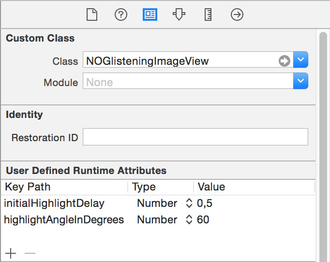

# NOGlisteningImageView

[](http://cocoapods.org/pods/NOGlisteningImageView)
[](http://cocoapods.org/pods/NOGlisteningImageView)
[](http://cocoapods.org/pods/NOGlisteningImageView)

A drop-in replacement for UIImageView. Repeatedly plays a simple highlight animation, similar to a highlight on a coin when a bright light moves quickly alongside it.


Originally developed to be used in storyboards or nibs when it is needed to draw user attention to certain graphical elements. All public properties can be configured by setting in the User Defined Runtime Attributes section in Xcode's Identity Inspector.

Animations start playing automatically when this view is added to a UIWindow, and stops when it is removed form one.

Note: this effect is internally implemented as a Quartz gradient layer masked with the original image, so be cautious of performance.

## Installation

NOGlisteningImageView is available through [CocoaPods](http://cocoapods.org). To install
it, simply add the following line to your Podfile:

```ruby
pod "NOGlisteningImageView"
```

Or just drag the files ```NOGlisteningImageView.h``` and ```NOGlisteningImageView.m``` to your Xcode project. 

This class requires ARC enabled.

### Usage

Place an `Image View` in your **nib** and select it. Open Utilities→Identity Inspector (`⌥⌘3`) and assign `NOGlisteningImageView` class.

Or create it in code:

```obj-c
#import "NOGlisteningImageView.h"

NOGlisteningImageView *imageView = [[NOGlisteningImageView alloc] initWithImage:[UIImage imageNamed:@"Coin"]];
```

```swift
var view = NOGlisteningImageView(image: UIImage(named: "Coin"))
```

### Customization

By default, `NOGlisteningImageView` starts playing the highlight immediately with 3 seconds interval; it is placed at 30°. 

There are various parameters affecting the animation, please refer to the header file for details.

An easy way to change them is setting appropriate values while editing a storyboard/nib file, see the screenshot below.



### License

This project is licensed under the terms of the [MIT license](http://memega.mit-license.org/).
